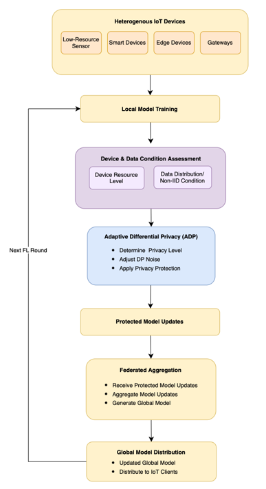

# IDB30102_GroupU_AdaptiveDP_HeteroIoT
# ADDRESSING PRIVACY-PERFORMANCE TRADE-OFFS IN HETEROGENEOUS IOT ENVIRONMENTS USING ADAPTIVE DIFFERENTIAL PRIVACY IN FEDERATED LEARNING

## Group Information

**Group Number:** Group U

| No. | Name | Student ID |
|-----|------|------------|
| 1. | NUR SYAZA ARDIENA BINTI ZAMANI | 52215124294 |
| 2. | NUR AMAL SYATIRAH BINTI SHA'ARI | 52215124391 |
| 3. | NUR ATIQAH ATHIRAH BINTI ASRUL SHAHIR | 52215124348 |
| 4. | NUR NAZIIHAH BATRISHIA BINTI MOKHLIS | 52215124357 |
| 5. | NURIN IZZATI BINTI MUKHRIZ | 52215124451 |

---

## Assigned Research Area

**Privacy and Data Protection**

This research focuses on privacy preserving techniques for protecting sensitive IoT data in Federated Learning environments, with particular emphasis on Differential Privacy and the privacy-performance-resource trade-off under heterogeneous IoT conditions.

---

## Research Problem

Problem Statement 1: Privacy-Performance Trade-offs in Differential Privacy
Problem Statement 2: Privacy Configuration in Heterogeneous IoT Environments

---

## Research Aim

The aim of this research is to address privacy-performance trade-offs in heterogeneous IoT environments by proposing an adaptive Differential Privacy approach for Federated Learning that balances privacy protection, model performance, and resource efficiency according to varying device and environmental conditions.

---

## Research Objectives

RO1: **To study** the privacy-performance trade-offs associated with Differential Privacy in Federated Learning for heterogeneous IoT environments.

RO2: **To design** an adaptive Differential Privacy approach for Federated Learning in heterogeneous IoT environments.

RO3: **To test** the proposed adaptive Differential Privacy approach against a conventional fixed Differential Privacy approach based on privacy, model performance, and resource efficiency metrics.

---

## Proposed Solution

The proposed solution is an **Adaptive Differential Privacy (ADP) module** integrated into a Federated Learning pipeline.

Instead of applying the same privacy configuration to every IoT client, the proposed module will consider differences in **device capability and data heterogeneity** when determining the appropriate privacy configuration.

The proposed workflow consists of:

1. Simulating heterogeneous IoT clients.
2. Distributing IoT cybersecurity data using non-IID data distributions.
3. Performing local model training on each client.
4. Assessing device capability and data heterogeneity.
5. Determining an appropriate privacy configuration.
6. Applying Differential Privacy through gradient clipping and noise perturbation.
7. Aggregating protected model updates using Federated Averaging (FedAvg).
8. Distributing the updated global model to participating clients.
9. Repeating the process across multiple Federated Learning rounds.

The proposed approach will be evaluated against a **Fixed DP-FedAvg baseline**, where the same privacy configuration is applied across all clients.

---

## Research Methodology

### Design Science Research Methodology (DSRM)

The study adopts **Design Science Research Methodology (DSRM)** as the primary research methodology because the research involves designing, developing, demonstrating, and evaluating a technical artefact.

The DSRM process consists of six phases:

| Phase | Research Activity |
|------|-------------------|
| 1. Problem Identification and Motivation | Identify privacy-performance-resource trade-offs in heterogeneous IoT FL environments. |
| 2. Define Objectives of a Solution | Define objectives and evaluation criteria for the proposed ADP module. |
| 3. Artefact Design and Development | Design and develop the Adaptive Differential Privacy module. |
| 4. Demonstration | Demonstrate the module using simulated heterogeneous FL clients and non-IID IoT data. |
| 5. Evaluation | Compare ADP against Fixed DP using predefined evaluation metrics. |
| 6. Communication | Document the methodology, implementation, findings, limitations, and conclusions. |

---

### Development Model

**Evolutionary Prototyping**

Evolutionary Prototyping will be used to incrementally develop and refine the proposed Adaptive Differential Privacy module and its Federated Learning simulation environment.

---

## Proposed Evaluation Plan

The proposed solution will be evaluated using a simulated heterogeneous Federated Learning environment.

### Baseline

**Fixed DP-FedAvg**

The baseline applies a uniform Differential Privacy configuration across all participating clients.

### Proposed Approach

**Adaptive DP-FedAvg**

The proposed approach adjusts the privacy configuration according to simulated client conditions, particularly device capability and data heterogeneity.

Both approaches will use the same dataset, FL model, number of clients, data distribution, and experimental environment to ensure a fair comparison.

### Dataset

A publicly available **IoT cybersecurity dataset** will be selected for the proof-of-concept implementation.

Potential datasets include:

- **N-BaIoT**
- **ToN-IoT**

The final dataset will be selected based on its relevance to IoT cybersecurity, data characteristics, and suitability for creating non-IID client distributions.

### Evaluation Metrics

| Evaluation Dimension | Metrics |
|----------------------|---------|
| Privacy Protection | Privacy budget (ε) |
| Model Performance | Accuracy, Precision, Recall, F1-score |
| Resource Efficiency | Computation time |
| Communication Efficiency | Communication overhead and/or latency, where measurable |

The evaluation will determine whether adaptive privacy configuration provides a more balanced trade-off between privacy protection, model performance, and resource efficiency compared with Fixed DP.

---

## Proposed System Architecture

The proposed architecture integrates Adaptive Differential Privacy into the Federated Learning workflow.

---

## Technical Components

The repository contains or will contain the following technical components:

| Component | Description |
|---|---|
| **IoT Client Simulation** | Simulates multiple IoT clients with different device capability conditions. |
| **Dataset and Preprocessing** | Loads, cleans, encodes, and prepares the selected IoT cybersecurity dataset. |
| **Data Distribution** | Creates heterogeneous and non-IID data distributions across clients. |
| **Local Model Training** | Trains the machine learning model locally without sharing raw data. |
| **Device & Data Condition Assessment** | Assesses client conditions used for privacy adaptation. |
| **Adaptive DP Module** | Determines privacy settings and applies Differential Privacy to model updates. |
| **Federated Aggregation** | Aggregates protected client updates using Federated Averaging (FedAvg). |
| **Global Model Distribution** | Sends the updated global model back to participating clients. |
| **Evaluation Module** | Records privacy, model performance, and resource-related metrics. |

---
## Technologies and Tools

### Programming Language

- Python

### Frameworks and Libraries

- Flower
- PyTorch
- NumPy
- Pandas
- Scikit-learn

### Dataset

- N-BaIoT or ToN-IoT
- Final dataset will be confirmed during implementation.

### Development and Experimentation Tools

- Git
- GitHub
- Jupyter Notebook / Python environment
- Virtual environment (venv or Conda)
